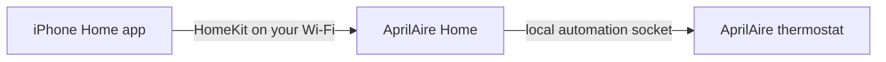

# AprilAire Home

A desktop app that connects an AprilAire Wi-Fi thermostat, including the 8920W, to the Apple Home app. It runs on a computer in the house. It does not use a VPS, a paid relay, or an account on a server we run.



The computer has to stay on and on the same network as the thermostat and the iPhone. Closing the window does not stop the connection.

## Install

You need Python 3.11 or newer. The installer creates a private environment in your user folder and an application shortcut.

macOS or Linux:

```bash
./scripts/install.sh
```

Then open **AprilAire Home** from the application menu, or run `aprilaire-homekit` from that environment. On Linux the shortcut is installed for your user. If the desktop window cannot open, the same screen opens in a browser. On Debian or Ubuntu, `sudo apt-get install python3-gi gir1.2-webkit2-4.1` installs the native window toolkit.

Windows, in PowerShell:

```powershell
.\scripts\install.ps1
```

Use the **AprilAire Home** shortcut on the desktop. It starts without a terminal window.

## Use it

1. On the thermostat, hold **Contractor Info** for about 10 seconds. Set **Automation Enable** to **Automation System**, not Aprilaire Cloud. The 8920W installation manual does not list this setting. If the menu is not there, this app cannot control that panel. Details are in [RESEARCH.md](RESEARCH.md).
2. Open AprilAire Home. It scans the local network for the automation port and then asks the device for its model and MAC address.
3. Tap the thermostat. If the scan finds nothing, type its IP address. Reserve that address in your router so it does not change.
4. Leave the bridge running. The window shows a pairing QR code and a setup code such as `482-19-736`.
5. On the iPhone, open the Home app, tap **+**, then **Add Accessory**, and scan the code. If the camera will not scan it, tap **More options** and type the code.
6. Leave **Start AprilAire Home when I log in** on. After a reboot, log in to this computer once. The Home tile then works without opening the window.

The Home tile can set Off, Heat, Cool, and Auto, the temperature, and it shows the current temperature, whether the equipment is heating or cooling, and the indoor humidity when the panel reports it.

## What stays on this computer

| Item | Where it lives |
| --- | --- |
| Saved thermostat, logs | Linux: `~/.local/share/aprilaire-homekit`. macOS: `~/Library/Application Support/AprilAire Home`. Windows: `%APPDATA%\AprilAire Home` |
| HomeKit keys and setup code | `homekit.json` and `homekit.state` in that folder, mode `0600` when the system allows it |
| Window and controls | `127.0.0.1` only. Other computers cannot open the page |
| Thermostat traffic | Local TCP, usually port **8000**. No AprilAire account is used |
| HomeKit traffic | Local TCP, default port **51826**, plus mDNS so the iPhone can find the accessory |

There is no cloud login in this app. The thermostat protocol has no password, so anyone on the same LAN who can open port 8000 can talk to the panel. That is how AprilAire's automation socket works. Keep the thermostat on your home network.

The panel accepts one automation connection. Quit Home Assistant's AprilAire integration, or any other automation client, before using this app. A second connection can freeze the panel until you power-cycle it.

## If something is wrong

- **Nothing was found.** The panel is probably still in Aprilaire Cloud mode, or this computer is not on the same network. Enter the IP address. The check below tells you whether the panel speaks the protocol.
- **The code never appears.** Start the bridge from the window. The iPhone has to be on the same Wi-Fi, not a guest network that blocks device-to-device traffic. Allow incoming TCP 51826 and mDNS (UDP 5353) on the computer.
- **Home says the accessory is not responding.** The computer is asleep, the bridge was stopped, or the thermostat connection dropped. Open the window and read the thermostat status. The log path is at the bottom of Troubleshooting.
- **The panel is frozen.** Turn its breaker off for 30 seconds, then on. Only one client may be connected.
- **You replaced the computer or want to pair again.** Remove the accessory in the Home app first, then use **Reset HomeKit pairing**.

A support check, if you are comfortable with a terminal:

```bash
aprilaire-homekit check --host 192.168.1.50
```

A working 8920W prints model `8920W` and a MAC address. `aprilaire-homekit --version` prints the app version.

## Limits

This was tested against the AprilAire automation protocol with a local stand-in, not against a physical 8920W. On the real panel, confirm the Automation Enable menu, that the model reports as 8920W, and that a Home app change actually runs the equipment. Switching Automation Enable away from Aprilaire Cloud may affect Alexa, Google, or the AprilAire phone app. Check those if you use them.

The automation socket steps temperatures in half degrees Celsius. The window shows Fahrenheit to the nearest degree. Auto mode in Home uses separate heat and cool limits, and HomeKit's heat limit tops out at 25°C (77°F).

Fan-only, schedules, dehumidify, and fresh air are not on the Home tile.

## Development

```bash
python3 -m venv .venv
.venv/bin/pip install -e ".[dev]"
.venv/bin/ruff check src tests
.venv/bin/pytest
.venv/bin/aprilaire-homekit
```

`APRILAIRE_DATA_DIR` points the app at another folder. `.env.example` lists the other optional variables. You do not need a config file for normal use.

## License

Copyright 2026 Anthony DiTano. Licensed under GPL-3.0-or-later. See [LICENSE](LICENSE). Protocol behavior comes from [pyaprilaire](https://github.com/chamberlain2007/pyaprilaire) and the public AprilAire automation description. See [RESEARCH.md](RESEARCH.md).
